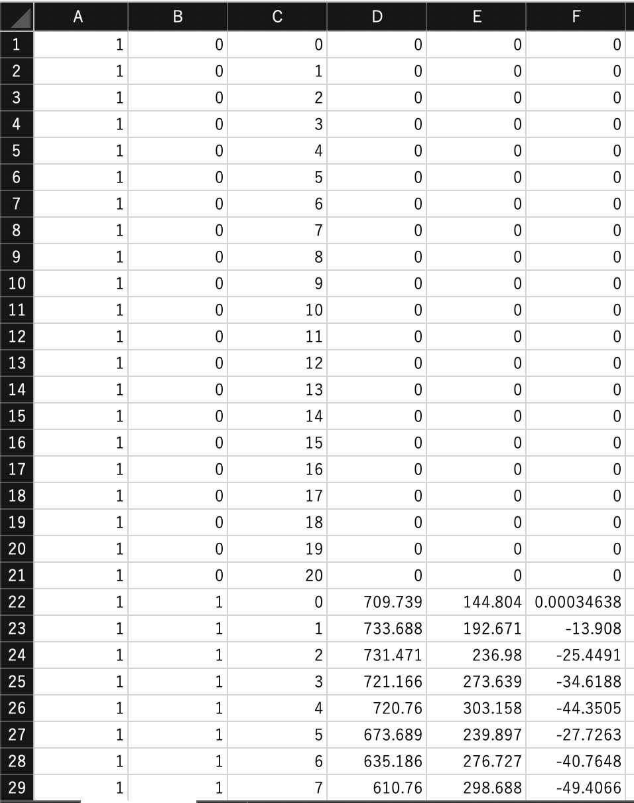

#  C++版Mediapipeを用いた顔&手の3D座標取得と，手と顔の最短距離の計算

[Mediapipe](https://github.com/google/mediapipe)を用いた顔と手の座標を取得した後，指と顔の最短ポイントと最短距離を算出しています．

＊C++版を用いて行いました．

＊これはリアルタイム映像ではなく，すでに記録した映像で行っています．


## 実装の方法

### 1. [Mediapipe](https://github.com/google/mediapipe)のgitフォルダをクローン(またはDownload)

```
git clone https://github.com/google/mediapipe.git

```

実装の方法は，[公式のページ](https://google.github.io/mediapipe/getting_started/install.html)，[個人が書かれたブログ](http://kunsen.net/2021/01/30/post-3543/)を参考にしてください

### 2. 上のgitフォルダをclone(またはDownload)

```
git clone https://github.com/ShutoIna/mp_cpp.git

```


### 3. 1の以下のフォルダを，2のフォルダと置き換える

1. mediapipe/mediapipe/graphs　←　mp_cpp/graphs  (左のフォルダは不要なので削除)  
2. mediapipe/mediapipe/examples　←　mp_cpp/examples　(左のフォルダは不要なので削除)

として下さい．(以降は，1のmediapipeフォルダを利用)

### 4. コマンドによるディレクトリ作成

管理を容易にするために，データ保管用フォルダを作成します．Dataフォルダを作成し，各ユーザの情報をID毎に分けて保管します．

(方法) mediapipeフォルダまでコマンドラインで移動(cd)した後，データ保管用フォルダを作成(mkdir)  
＊フォルダ名は，必ず**ID(整数)** として下さい(例えば，IDが5678なら，下の様に入力)

```

cd mediapipe

```
```
mkdir -p ../Data/5678←(数字部分は適宜変える)

```

#### 5.1．手の座標

以下の2つのコマンドを実行すると，

```
bazel build -c opt --define MEDIAPIPE_DISABLE_GPU=1 mediapipe/examples/desktop/hand_tracking:hand_tracking_cpu

```

```
GLOG_logtostderr=1 bazel-bin/mediapipe/examples/desktop/hand_tracking/hand_tracking_cpu --calculator_graph_config_file=mediapipe/graphs/hand_tracking/hand_tracking_desktop_live.pbtxt --input_video_path=(入力動画のパス) --output_video_path=../Data/固有のID(整数)/hand.mov

```

「**ID(整数)を入力して下さい ↓** 」という文字が現れます.  
**4と必ず同じ数字を入力して** ，Enterを押すと，**hand.movとID_hand.csvが，Data/ID(整数)フォルダ内に生成されます**

#### 5.2．顔の座標

以下の2つのコマンドを実行すると，

```
bazel build -c opt --define MEDIAPIPE_DISABLE_GPU=1 mediapipe/examples/desktop/face_mesh:face_mesh_cpu

```

```
GLOG_logtostderr=1 bazel-bin/mediapipe/examples/desktop/face_mesh/face_mesh_cpu --calculator_graph_config_file=mediapipe/graphs/face_mesh/face_mesh_desktop_live.pbtxt --input_video_path=(入力動画のパス) --output_video_path=../Data/固有のID(整数を入力)/face.mov

```

「**ID(整数)を入力して下さい ↓** 」という文字が現れます.  
4, 5.1と同じ数字を入力してEnterを押すと，**face.movとID_face.csvが，Data/ID(整数)フォルダ内に生成されます**


#### csvの説明

各csvの1行目は，動画の横サイズ(W)，縦サイズ(H)，総フレーム数(C)，fpsが表示されます．

2行目以降は，左から
1. フレーム数(1~C)
2. 左手(0)or右手(1)※顔のcsvでは全て0
3. インデックス(骨格番号)※手は0〜20，顔は0〜467
4. x座標(0~W)
5. y座標(0~H)
6. z座標(-W~W)

を表しています．

検出されないフレームに関しては，全ての座標を0としました．

例えば100フレームの動画の場合，100x42+1=4201行，100x468+1=46801行のcsvが生成されます．


<!--  -->

(handのcsv例)

### 6 顔の最適なフレーム検出

```
python index.py ../Data/固有のID(整数)/face.mov

```
とすることで，フレーム付きの動画が出力されます．動画から，最も顔のトラッキングができているフレームを入力して下さい．

### 7 手と顔の距離計算

```
python index.py 89←先程のフレーム番号

```

