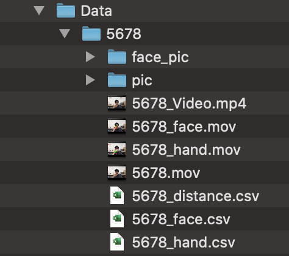

#  C++版Mediapipeを用いた顔&手の3D座標取得と，手と顔の最短距離の計算

[Mediapipe](https://github.com/google/mediapipe)を用いた顔と手の座標を取得した後，指と顔の最短ポイントと最短距離を算出しています．

＊C++版を用いて行いました．

＊これはリアルタイム映像ではなく，すでに記録した映像で行っています．


## 実装の方法

### 1. [Mediapipe](https://github.com/google/mediapipe)のgitフォルダをクローン(またはDownload)

```
git clone https://github.com/google/mediapipe.git

```

実装の方法は，[公式のページ](https://google.github.io/mediapipe/getting_started/install.html)，[個人が書かれたブログ](http://kunsen.net/2021/01/30/post-3543/), [Bazel公式サイト](https://bazel.build/)を参考にしてください

### 2. 上のgitフォルダをclone(またはDownload)

```
git clone https://github.com/ShutoIna/mp_cpp.git

```


### 3. 1の以下のフォルダを，2のフォルダと置き換える

1. mediapipe/mediapipe/graphs　←　mp_cpp/graphs  (左のフォルダは不要なので削除)  
2. mediapipe/mediapipe/examples　←　mp_cpp/examples　(左のフォルダは不要なので削除)

また，残りのpy_fileは，上のgraphsやexamplesと同じディレクトリに入れてください

3. mediapipe/mediapipe/　←　mp_cpp/pyfiles

として下さい．(以降は，1のmediapipeフォルダを利用)

### 4. コマンドによるディレクトリ作成

管理を容易にするために，データ保管用フォルダを作成します．Dataフォルダを作成し，各ユーザの情報をID毎に分けて保管します．

(方法) mediapipeフォルダまでコマンドラインで移動(cd)した後，データ保管用フォルダを作成(mkdir)  
＊フォルダ名は，必ず**ID(数字，アルファベット，アンダーバー_の組み合わせ)** として下さい(例えば，IDが5678なら，下の様に入力)  

＊「ID=5678」では，変数IDに5678を設定することで，以降「$ID」で参照が可能になります．．

＊「=」の左右にスペースを入れないで下さい．(入れるとエラーとなります．)

```

cd mediapipe

```
```
ID=5678

```

```

mkdir -p ../Data/$ID

```
この操作により，以下の様な階層構造が形成されます．


<!--  -->

以降，作成したファイルは，全て**Data/ID(この場合は5678)フォルダ**に入れます．

### 5.0．動画のパス作成&コピー

コマンドをより簡潔にするために，入力する動画のパスを，以下のように変数inpに代入します．  
以降，$inpで参照されます．(動画を変えたいときは，都度inpを書き換えて下さい)

```
inp=(入力動画のパス)

```
また，元動画を新たに作成したフォルダにコピーします．(ID.mov)

```
cp $inp ../Data/$ID/$ID.mov

```


#### 5.1．手の座標

以下の2つのコマンドを実行すると，

```
bazel build -c opt --define MEDIAPIPE_DISABLE_GPU=1 mediapipe/examples/desktop/hand_tracking:hand_tracking_cpu

```

```
GLOG_logtostderr=1 bazel-bin/mediapipe/examples/desktop/hand_tracking/hand_tracking_cpu --calculator_graph_config_file=mediapipe/graphs/hand_tracking/hand_tracking_desktop_live.pbtxt --input_video_path=$inp --output_video_path=../Data/$ID/${ID}_hand.mov

```

「**ID(整数)を入力して下さい ↓** 」という文字が現れます.  
**4と必ず同じIDを入力して** ，Enterを押すと，**ID_hand.movとID_hand.csvが，Data/IDフォルダ内に生成されます**

#### 5.2．顔の座標

以下の2つのコマンドを実行すると，

```
bazel build -c opt --define MEDIAPIPE_DISABLE_GPU=1 mediapipe/examples/desktop/face_mesh:face_mesh_cpu

```

```
GLOG_logtostderr=1 bazel-bin/mediapipe/examples/desktop/face_mesh/face_mesh_cpu --calculator_graph_config_file=mediapipe/graphs/face_mesh/face_mesh_desktop_live.pbtxt --input_video_path=$inp --output_video_path=../Data/$ID/${ID}_face.mov

```

「**ID(整数)を入力して下さい ↓** 」という文字が現れます.  
4, 5.1と同じIDを入力してEnterを押すと，**face_ID.movとID_face.csvが，Data/IDフォルダ内に生成されます**

ここまでで，以下の様なファイルが生成されます．


<!--  -->


#### csvの説明

左から
1. フレーム数(1~C)
2. 左手(0)or右手(1)※顔のcsvでは全て1
3. インデックス(骨格番号)※手は0〜20，顔は0〜467
4. x座標(0~W) : 右にあるほど大きい　(例)左手(顔)のx座標 < 右手(顔)のx座標
5. y座標(0~H) : 上にあるほど大きい　(例)顎のy座標 < 額のy座標
6. z座標(-W~W) : 手前にあるほど大きい　(例)鼻先のz座標 < こめかみのz座標

を表しています．

検出されないフレームに関しては，全ての座標を0としました．

例えば100フレームの動画の場合，100x42=420行(hand.csv)，100x468=46800行(face.csv)となります．


<!--  -->

(handのcsv例)

### 6 顔の最適なフレーム検出

```
python mediapipe/pyfiles/facesp.py 

```
とすることで，IDを入力した後,  

フレーム分割された画像が**Data/ID/face_picフォルダ**に出力されます．  

また，同時に，元動画の分割画像も**Data/ID/picフォルダ**に出力されます．

ここまでで，以下の様なファイルが生成されます．


<!--  -->


### 7 手と顔の距離計算&接触部分の可視化

```
python mediapipe/pyfiles/gui4.py

```
とすることで，GUIアプリが立ち上がり，mp_pythonとほぼ同様の内容ができます．


<!--  -->

(gui4.pyの起動画面)

具体的には，  
1. 一番上の欄に今までと同じIDを入力した後，  
2. [顔フレーム検索]で，最適な顔トラッキング画像を選択，
3. [距離計算開始]で，フレーム毎の手と顔の距離を計算し，distance.csv出力，  
4. [位置情報付与]で，距離に基づいた接触部位の可視化を行い，ID_Video.mp4を出力しています．


最終的に，以下の様な構成になります．(csv3つ，動画4つ，フォルダ2つ)



<!--  -->

実際に試してみたものを，以下のGoogle Driveに載せています．ご確認ください．

https://drive.google.com/drive/folders/1RvKRAyODoowFTyk8qDdYIpyTyTcREizV?usp=sharing

